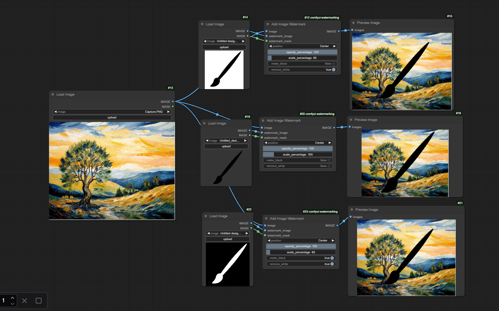
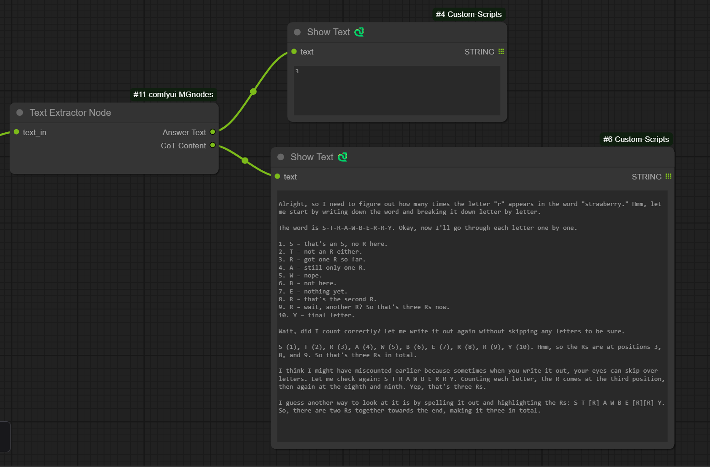

# ComfyUI MGnodes Collection

A collection of custom nodes for ComfyUI focused on simplicity and usability.


## Available Nodes

### 1. Image Watermark Node
Add image watermarks with advanced controls for transparency, positioning, and color manipulation.

Features:
- Add image watermarks with adjustable transparency
- Multiple positioning options (Center, Top Left, Top Right, Bottom Left, Bottom Right, Tiled)
- Scale watermark size
- Remove white background from watermark
- Invert watermark colors
- Preserve transparency in both base image and watermark

### 2. Text Extractor Node
A utility node for processing text output from Language Models (LLMs), specifically handling Chain-of-Thought content.


Features:
- Extracts content between `<think>...</think>` tags
- Outputs both cleaned text and extracted thoughts
- Useful for processing LLM outputs with reasoning steps
- Supports multiple think blocks in a single input

### 3. Flux Kontext Diff Merge (Optimized)
Preserve original image quality by merging only AI-edited regions back into the source.

Features:
- Adaptive, color-difference, SSIM*, and combined change detection
- Multiple blending modes (poisson*, alpha, multiband*, gaussian*)
- Intelligent mask refinement and preview output
- Batch support with optional manual mask input

\*Requires optional dependencies: `opencv-python` for advanced blending and
mask operations, `scikit-image` for SSIM detection.

## Installation

### Option 1: ComfyUI Manager (Recommended)
The easiest way to install is through the ComfyUI Manager. Simply search for "MGnodes" and click install.

### Option 2: Manual Installation
1. Navigate to your ComfyUI custom nodes directory:
```bash
cd ComfyUI/custom_nodes/
```

2. Clone this repository:
```bash
git clone https://github.com/meanin2/comfyui-MGnodes.git
```

3. Restart ComfyUI

## Usage

### Image Watermark Node
1. Load your base image using a "Load Image" node
2. Load your watermark image using another "Load Image" node
3. Connect both to the "Add Image Watermark" node
4. Configure the watermark settings:
   - **Position**: Choose where to place the watermark
   - **Opacity**: Adjust transparency (0-100%)
   - **Scale**: Resize the watermark (10-1000%)
   - **Make Black**: Invert the watermark colors
   - **Remove White**: Make white pixels transparent

### Text Extractor Node
1. Connect any text output (typically from an LLM node) to the Text Extractor
2. The node will output two strings:
   - **Answer Text**: The input text with all `<think>...</think>` sections removed
   - **CoT Content**: The extracted content from within the `<think>` tags

### Example Workflow

Check out the `examples` folder for:
- A complete watermark workflow you can import into ComfyUI
- Sample images used in the showcase
- Test watermark images

## Tips
- For best watermark results with "Remove White", ensure your watermark has a clean white background
- When using "Make Black", the inversion happens before white removal
- The watermark mask input is optional and can be used for additional transparency control
- Scale values above 100% will enlarge the watermark, below 100% will shrink it
- For text extraction, multiple `<think>` blocks will be joined with newlines in the CoT output
